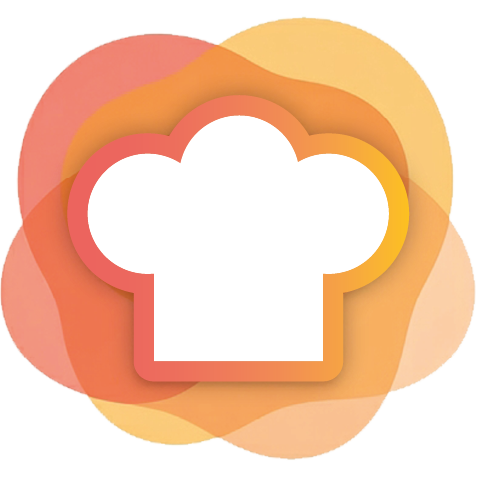
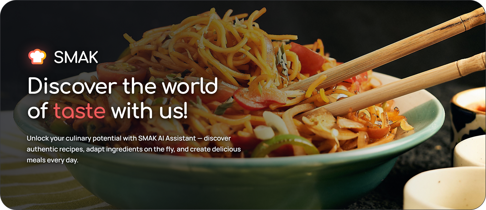

<div align="center">
  
  <h1>SMAK</h1>
  <p><b>AI-powered culinary platform with semantic recipe discovery and real-time conversational sous-chef.</b></p>

  <p>
    <a href="https://github.com/alukiank/smak-culinary-platform/releases"></a>
    
    
    
    
    <a href="LICENSE"></a>
  </p>

  <p>
    <b>UI Language:</b> Ukrainian 🇺🇦 &nbsp;|&nbsp;
    <b>Docs:</b> English 🇬🇧
  </p>

  <p align="center">
    
  </p>

  <p>
    SMAK is an intelligent culinary platform designed to transform everyday cooking into an effortless, personalized experience. Powered by an AI sous-chef that understands dietary preferences, pantry ingredients, and culinary techniques, SMAK helps home cooks discover inspired recipes, adapt meals on the fly, and cook with confidence.
  </p>

</div>

<details>
<summary><b>Table of Contents</b></summary>

- [Overview & Value Proposition](#overview--value-proposition)
- [Product Showcase](#product-showcase)
- [Key Features](#key-features)
- [System Architecture](#system-architecture)
- [Monorepo Structure](#monorepo-structure)
- [Quick Start (Docker Compose)](#quick-start-docker-compose)
- [Local Development](#local-development)
- [Technology Stack](#technology-stack)
- [License & Attributions](#license--attributions)

</details>

## Overview & Value Proposition

Traditional recipe websites are cluttered with ads, rigid search forms, and static step lists that cannot adapt to missing ingredients or dietary restrictions. 

**SMAK solves this by combining modern web architecture with agentic AI:**

- **Semantic Discovery:** Find recipes by mood, available ingredients, or dietary preferences without requiring exact keyword matches.
- **Real-Time AI Guidance:** An interactive sous-chef assists with ingredient substitutions, cooking times, and culinary techniques during meal preparation.
- **Automated Quality & Safety:** User-submitted recipes and reviews pass through automated AI moderation queues to keep catalog content reliable and safe.

## Product Showcase

<!-- Replace the video/GIF placeholders below with your actual demo recordings -->

### 1. Conversational AI Assistant & Live Tool Execution
Natural language culinary guidance with real-time Server-Sent Events (SSE) streaming, dynamic database search tool-calling, and interactive recipe slider injection.

<!-- Demo Video / GIF -->
<!-- <video src="https://your-domain.com/videos/ai-assistant-demo.mp4" controls width="100%"></video> -->
> *The AI assistant processes complex queries in natural Ukrainian, handles dietary exclusions (e.g. "що приготувати без лактози на вечерю"), calls backend database tools, and streams response tokens alongside interactive recipe sliders.*

### 2. Hybrid Semantic Search & Dietary Filtering
Faceted recipe discovery combining relational SQL filtering (allergens, vegan/vegetarian, cooking duration, health scores) with 768-dimensional vector cosine similarity via `pgvector`.

<!-- Demo Video / GIF -->
<!-- <video src="https://your-domain.com/videos/search-filter-demo.mp4" controls width="100%"></video> -->
> *Demonstrates typo-tolerant Ukrainian semantic search, multi-tag filtering, and instant database querying.*

### 3. In-Context Recipe Experience & Floating AI Companion
Comprehensive recipe view featuring step-by-step cooking directions, ingredient checklists, and an embedded floating AI assistant.

<!-- Demo Video / GIF -->
<!-- <video src="https://your-domain.com/videos/recipe-detail-demo.mp4" controls width="100%"></video> -->
> *Demonstrates interactive recipe interaction and real-time culinary Q&A with full recipe context automatically injected.*

## Key Features

- **AI Culinary Assistant**: Conversational assistant powered by Google Gemini (`gemini-3.1-flash-lite`) supporting multi-turn tool calling (recipe searching, dietary constraints) and live Server-Sent Events (SSE) streaming with interactive UI card injection.
- **Hybrid Semantic Search**: Combines PostgreSQL relational filtering (allergens, vegan/vegetarian flags, cooking duration, difficulty) with 768-dimensional vector cosine similarity via `pgvector` and Gemini embeddings.
- **In-Context Recipe Guidance**: Recipe view with ingredient checklists, step-by-step directions, and an integrated floating AI assistant for instant culinary substitutions and advice.
- **Automated Content Moderation**: Asynchronous BullMQ queue worker evaluating submitted recipes and reviews against safety policies via structured Gemini prompts.
- **Subscription Billing**: Monetization pipeline with LiqPay payment processing, subscription tiers (Free, Pro, Premium), and Redis-backed AI usage guards.
- **Production Infrastructure**: Single-entry reverse proxy via Caddy, automated SSL/TLS termination, centralized CORS handling, and multi-stage Docker builds.

## System Architecture

```
                                 ┌───────────────────────┐
                                 │   Browser / Client    │
                                 └───────────┬───────────┘
                                             │ HTTP / HTTPS (Ports 80/443)
                                             ▼
                                 ┌───────────────────────┐
                                 │  Caddy Reverse Proxy  │
                                 └───┬───────────────┬───┘
                                     │               │
                    /api/*, /admin/* │               │ /* (All other routes)
                                     ▼               ▼
                        ┌─────────────────┐     ┌─────────────────┐
                        │  NestJS Backend │     │ Nuxt 4 Frontend │
                        └───┬─────┬─────┬─┘     └─────────────────┘
                            │     │     │
            ┌───────────────┘     │     └───────────────┐
            ▼                     ▼                     ▼
┌───────────────────────┐ ┌───────────────┐ ┌────────────────────────┐
│ PostgreSQL + pgvector │ │ Redis + BullMQ│ │  Google Gemini GenAI   │
│ (Relational & Vectors)│ │(Cache & Queue)│ │ (Embeddings & Assistant│
└───────────────────────┘ └───────────────┘ └────────────────────────┘
```

## Monorepo Structure

- [**`api/`**](api/README.md) — NestJS 10 backend service handling business logic, vector search, Gemini AI orchestration, and BullMQ background workers.
- [**`client/`**](client/README.md) — Nuxt 4 / Vue 3 frontend application featuring hybrid SSR/CSR, `@nuxt/ui` design system, and live AI chat streaming.
- [**`dataset/`**](https://github.com/alukiank/smak-culinary-platform/releases) — Structured recipe dataset and media assets (hosted via GitHub Releases).

## Quick Start (Docker Compose)

The entire platform (Caddy, Nuxt 4 frontend, NestJS API, PostgreSQL with pgvector, and Redis) can be launched using Docker Compose.

### 1. Prerequisites
- [Docker Engine](https://docs.docker.com/engine/install/) `24+` and Docker Compose `v2+`
- Google Gemini API Key ([Google AI Studio](https://aistudio.google.com/))
- Cloudinary Account (for media uploads)

### 2. Configure Environment Files
Copy the production environment templates:

```bash
# Root environment
cp .env.prod.example .env.prod

# Backend API environment
cp api/.env.prod.example api/.env.prod

# Frontend Client environment
cp client/.env.prod.example client/.env.prod
```

Edit `api/.env.prod` to provide your `GEMINI_API_KEY`, `CLOUDINARY_*`, and `JWT_*` secrets.

### 3. Build and Start Services
```bash
docker compose -f docker-compose.prod.yml up -d --build
```

### 4. Apply Database Migrations
```bash
docker compose -f docker-compose.prod.yml exec api npm run migration:run:prod
```

### 5. (Optional) Seed Recipe Dataset
1. Download `smak-dataset.zip` from the latest [GitHub Release](https://github.com/alukiank/smak-culinary-platform/releases).
2. Unpack it into the root `dataset/` directory.
3. Run the interactive importer:
```bash
docker compose -f docker-compose.prod.yml exec api npm run import:dataset
```

The application will be live at `http://localhost` (or your configured domain via Caddy).

## Local Development

To run services independently on your local machine:

### Backend API
```bash
cd api
npm install
npm run migration:run
npm run start:dev
```
*API will run on `http://localhost:4000` (Swagger UI at `/admin/api-docs`).*

### Frontend Client
```bash
cd client
npm install
npm run dev
```
*Frontend will run on `http://localhost:3000`.*

## Technology Stack

| Layer | Technologies |
|---|---|
| **Frontend** | Nuxt 4, Vue 3, TypeScript, `@nuxt/ui` v4, Tailwind CSS, Lucide Icons, Vite |
| **Backend** | NestJS 10, TypeScript, TypeORM, Passport.js, Class-Validator, Swagger / OpenAPI |
| **AI & Search** | Google GenAI SDK (`gemini-3.1-flash-lite`, `gemini-embedding-001`), PostgreSQL `pgvector` |
| **Data & Queues** | PostgreSQL 16, Redis 7, BullMQ, Bull-Board |
| **Third-Party APIs**| Cloudinary CDN (media), LiqPay (payments), Nodemailer / Mailtrap (email) |
| **Infra & DevOps** | Docker, Docker Compose, Caddy Reverse Proxy |

## License & Attributions

- **License**: Open-sourced under the [MIT License](LICENSE).
- **Author**: [Andrii Lukianenko](mailto:a.lukiank@gmail.com)
- **Asset Attributions**: Detailed media origin documentation in [ATTRIBUTIONS.md](client/public/images/ATTRIBUTIONS.md).
