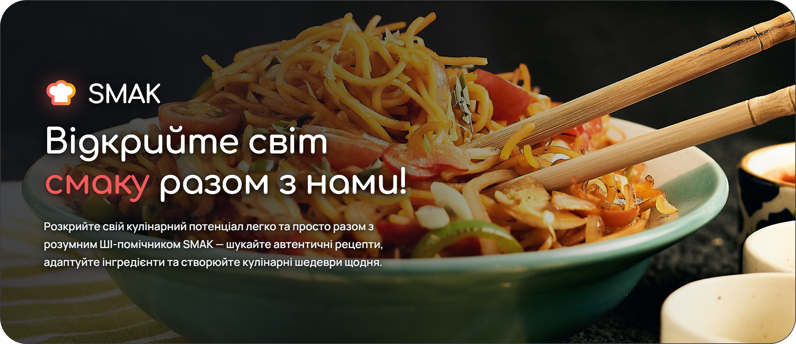
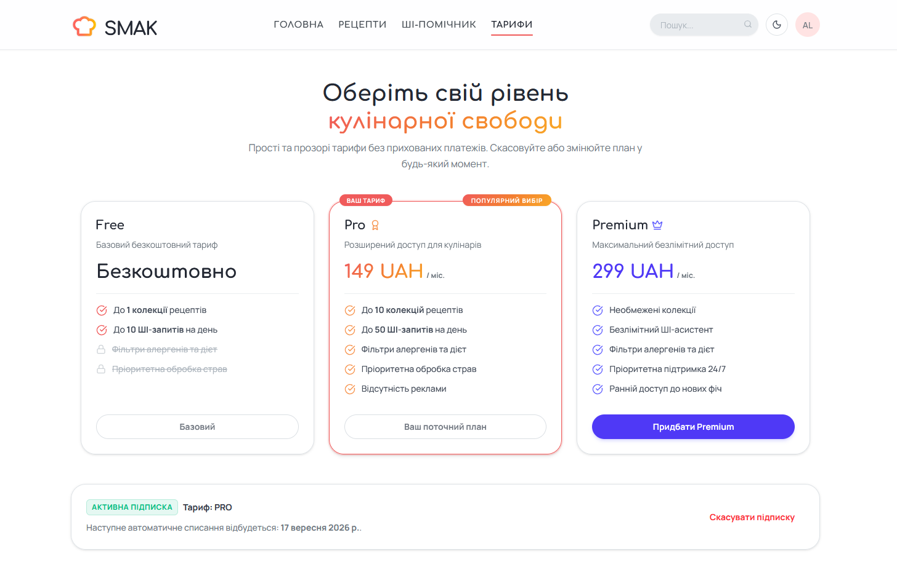

<div align="center">

  <p>
    <b>Language / Мова:</b> &nbsp;
    <a href="README.md">English 🇬🇧</a> &nbsp;|&nbsp;
    <a href="README.uk.md"><b>[ Українська 🇺🇦 ]</b></a>
  </p>

  <p>
    <a href="https://github.com/alukiank/smak-culinary-platform/releases"></a>
    
    
    
    
    <a href="LICENSE"></a>
  </p>

  <p align="center">
    
  </p>

  <p>
    SMAK — це інтелектуальна кулінарна платформа, створена для того, щоб перетворити щоденне приготування їжі на простий, персоналізований та надихаючий процес. Завдяки ШІ-помічнику, який розуміє харчові вподобання, наявні інгредієнти та кулінарні техніки, SMAK допомагає відкривати нові рецепти, адаптувати страви «на льоту» та готувати із задоволенням.
  </p>

</div>

<details>
<summary><b>Зміст</b></summary>

- [Огляд та цінність продукту](#огляд-та-цінність-продукту)
- [Демонстрація продукту](#демонстрація-продукту)
- [Ключові можливості](#ключові-можливості)
- [Архітектура системи](#архітектура-системи)
- [Структура монорепозиторію](#структура-монорепозиторію)
- [Швидкий старт (Docker Compose)](#швидкий-старт-docker-compose)
- [Локальна розробка](#локальна-розробка)
- [Стек технологій](#стек-технологій)
- [Ліцензія та авторство](#ліцензія-та-авторство)

</details>

## Огляд та цінність продукту

Традиційні кулінарні сайти перевантажені рекламою, негнучкими формами пошуку та статичними списками інструкцій, які не можна адаптувати під відсутні інгредієнти чи харчові обмеження.

**SMAK вирішує це завдяки поєднанню сучасної веб-архітектури та агентного штучного інтелекту:**

- **Семантичний пошук:** знаходьте рецепти за настроєм, наявними продуктами чи дієтичними вподобаннями без обов'язкового точного збігу ключових слів.
- **ШІ-помічник у реальному часі:** інтерактивний шеф допомагає із заміною інгредієнтів, часом приготування та кулінарними порадами безпосередньо під час готування.
- **Автоматизована якість та безпека:** опубліковані користувачами рецепти та відгуки проходять автоматичну чергу ШІ-модерації для збереження надійності та безпеки каталогу.

## Демонстрація продукту

### 1. Каталог рецептів, семантичний пошук та розширена фільтрація
Інтерактивна стрічка рецептів із комплексною панеллю фільтрації та семантичним пошуком.

<video src="https://github.com/user-attachments/assets/7c5051ae-091a-4d61-8c0f-7d2561ba024c" controls width="100%"></video>

> *Демонстрація перегляду стрічки рецептів, роботи висувної панелі фільтрів, дієтичних перемикачів та миттєвого оновлення каталогу.*

**Основний функціонал на сторінці:**
- **Дієтичні та алергенні перемикачі:** швидкі фільтри для веганських, вегетаріанських, безглютенових, безлактозних, горіхово-безпечних, халяльних та кошерних страв з автоматичною синхронізацією з профілем користувача.
- **Детальні кулінарні параметри:** фільтрація за категорією страви, кухнями світу (мультивибір), рівнем складності (Легко, Середньо, Складно), швидкістю приготування (Швидко, Помірно, Повільно) та мінімальним рейтингом відгуків (3+, 4+, 4.5+).
- **Інтерактивні слайдери:** зручні діапазонні слайдери для вибору максимального часу приготування (від 5 до 180+ хв) та мінімального індексу здоров'я (від 0 до 100%).
- **Гібридний семантичний пошук:** пошуковий рядок у реальному часі, що поєднує розуміння природної мови через векторні ембеддінги (`pgvector`) з реляційними SQL-обмеженнями.
- **Бейджі активних фільтрів та скидання:** візуальні бейджі застосованих параметрів із можливістю швидкого видалення в один клік та кнопка повного очищення фільтрів.
- **Адаптивна сітка та пагінація:** інформативні картки рецептів (час приготування, складність, індекс здоров'я, рейтинг спільноти) та серверна пагінація з індикатором кількості знайдених страв.

### 2. Діалоговий ШІ-шеф та виконання інструментів
Інтерактивний кулінарний асистент на базі Google Gemini, що підтримує багатокроковий виклик інструментів (tool calling) та потокову передачу відповідей через Server-Sent Events (SSE).

<video src="https://github.com/user-attachments/assets/9439dbdd-cca8-467b-9eed-a55395f9ba2e" controls width="100%"></video>

> *ШІ-асистент опрацьовує складні запити природною українською мовою, враховує дієтичні обмеження (наприклад, "що приготувати без лактози на вечерю"), викликає інструменти бази даних та стрімить токени відповідей разом з інтерактивними слайдерами рецептів.*

**Основні вміння ШІ:**
- **Розуміння природної мови та контексту:** повноцінна підтримка українськомовних запитів, розпізнавання тонкощів дієт, пошук страв за настроєм та ведення багатокрокових діалогів.
- **Багатокроковий виклик інструментів (Multi-Turn Tool Calling):** автономне виконання функцій бекенду (`search_recipes`, `get_recipe_details`) для пошуку та вибірки точних даних з бази рецептів.
- **Інжекція інтерактивних UI-карток та слайдерів:** передача метаданих через SSE для вбудовування інтерактивних каруселей рецептів (`ChatRecipeSlider`), карток страв та кнопок прямо в повідомлення чату.
- **Контекстний плаваючий помічник на сторінці рецепта:** автоматичне зчитування інгредієнтів та кроків поточної страви для порад щодо заміни продуктів, перерахунку пропорцій та техніки приготування.
- **Врахування дієтичних та алергенних обмежень:** автоматична перевірка та дотримання алергічного профілю користувача (`display_user_diets`, `display_user_allergies`) для гарантування безпечних рекомендацій.
- **Навігація по платформі та документація:** допомога користувачеві у використанні функцій сайту та налаштувань через інструмент `get_site_documentation`.

### 3. Тарифні плани та прозоре ціноутворення
Гнучка модель монетизації з матрицею можливостей, квотами на ШІ-запити та безпечною оплатою через LiqPay.

<p align="center">
  
</p>

## Ключові можливості

- **Кулінарний ШІ-асистент**: діалоговий помічник на базі Google Gemini із підтримкою багатокрокового виклику інструментів (пошук рецептів, дієтичні фільтри) та потокового стрімінгу через Server-Sent Events (SSE) з інтерактивними картками.
- **Гібридний семантичний пошук**: поєднання реляційної фільтрації PostgreSQL (алергени, веганські/вегетаріанські позначки, тривалість, складність) із косинусною подібністю 768-вимірних векторних ембеддінгів через `pgvector` та Gemini.
- **Контекстна допомога на сторінці страви**: детальний перегляд рецепта із чеклистом інгредієнтів, покроковими інструкціями та плаваючим ШІ-помічником для миттєвих кулінарних порад.
- **Автоматична модерація контенту**: асинхронний воркер черги BullMQ, що перевіряє додані рецепти та відгуки на відповідність правилам безпеки за допомогою структурованих запитів до Gemini.
- **Тарифні плани та білінг**: інтеграція платіжної системи LiqPay, підписки (Free, Pro, Premium) та обмеження лімітів ШІ-запитів на базі Redis.
- **Продакшн-інфраструктура**: єдина точка входу через зворотний проксі Caddy, автоматичне управління SSL/TLS-сертифікатами, централізований CORS та багатоетапні Docker-білди.

## Архітектура системи

```
                                 ┌───────────────────────┐
                                 │    Браузер / Клієнт   │
                                 └───────────┬───────────┘
                                             │ HTTP / HTTPS (Порти 80/443)
                                             ▼
                                 ┌───────────────────────┐
                                 │  Caddy Reverse Proxy  │
                                 └───┬───────────────┬───┘
                                     │               │
                    /api/*, /admin/* │               │ /* (Всі інші маршрути)
                                     ▼               ▼
                        ┌─────────────────┐     ┌─────────────────┐
                        │  NestJS Backend │     │ Nuxt 4 Frontend │
                        └───┬─────┬─────┬─┘     └─────────────────┘
                            │     │     │
            ┌───────────────┘     │     └───────────────┐
            ▼                     ▼                     ▼
┌───────────────────────┐ ┌───────────────┐ ┌────────────────────────┐
│ PostgreSQL + pgvector │ │ Redis + BullMQ│ │  Google Gemini GenAI   │
│(Реляційні та вектори) │ │ (Кеш і черги) │ │ (Ембеддінги й асистент)│
└───────────────────────┘ └───────────────┘ └────────────────────────┘
```

## Структура монорепозиторію

- [**`api/`**](api/README.md) — бекенд-сервіс на NestJS 10, що забезпечує бізнес-логіку, векторний пошук, оркестрацію Gemini AI та фонові воркери BullMQ.
- [**`client/`**](client/README.md) — фронтенд-застосунок на Nuxt 4 / Vue 3 з гібридним SSR/CSR-рендерингом, дизайн-системою `@nuxt/ui` та стрімінгом ШІ-чату в реальному часі.
- [**`dataset/`**](https://github.com/alukiank/smak-culinary-platform/releases) — структурований датасет рецептів та медіа-ресурси (розміщені у GitHub Releases).

## Швидкий старт (Docker Compose)

Усю платформу (Caddy, Nuxt 4 фронтенд, NestJS API, PostgreSQL із pgvector та Redis) можна розгорнути за допомогою Docker Compose.

### 1. Системні вимоги
- [Docker Engine](https://docs.docker.com/engine/install/) `24+` та Docker Compose `v2+`
- Ключ Google Gemini API ([Google AI Studio](https://aistudio.google.com/))
- Акаунт Cloudinary (для завантаження медіа)

### 2. Налаштування файлів конфігурації (.env)
Скопіюйте шаблони змінних середовища для продакшну:

```bash
# Кореневе середовище
cp .env.prod.example .env.prod

# Середовище бекенду API
cp api/.env.prod.example api/.env.prod

# Середовище клієнтської частини
cp client/.env.prod.example client/.env.prod
```

Відредагуйте `api/.env.prod` та вкажіть ваші значення для `GEMINI_API_KEY`, `CLOUDINARY_*` та `JWT_*`.

### 3. Збірка та запуск сервісів
```bash
docker compose -f docker-compose.prod.yml up -d --build
```

### 4. Застосування міграцій бази даних
```bash
docker compose -f docker-compose.prod.yml exec api npm run migration:run:prod
```

### 5. (Опціонально) Імпорт датасету рецептів
1. Завантажте `smak-dataset.zip` з останнього [GitHub Release](https://github.com/alukiank/smak-culinary-platform/releases).
2. Розархівуйте його в кореневу папку `dataset/`.
3. Запустіть інтерактивний імпортер:
```bash
docker compose -f docker-compose.prod.yml exec api npm run import:dataset
```

Застосунок буде доступний за адресою `http://localhost` (або за вашим доменом, налаштованим у Caddy).

## Локальна розробка

Для запуску сервісів окремо на локальному комп'ютері:

### Бекенд API
```bash
cd api
npm install
npm run migration:run
npm run start:dev
```
*API буде доступне на `http://localhost:4000` (Swagger UI за адресою `/admin/api-docs`).*

### Фронтенд клієнт
```bash
cd client
npm install
npm run dev
```
*Фронтенд буде доступний на `http://localhost:3000`.*

## Стек технологій

| Рівень | Технології |
|---|---|
| **Frontend** | Nuxt 4, Vue 3, TypeScript, `@nuxt/ui` v4, Tailwind CSS, Lucide Icons, Vite |
| **Backend** | NestJS 10, TypeScript, TypeORM, Passport.js, Class-Validator, Swagger / OpenAPI |
| **AI та пошук** | Google GenAI SDK (`gemini-3.1-flash-lite`, `gemini-embedding-001`), PostgreSQL `pgvector` |
| **Дані та черги** | PostgreSQL 16, Redis 7, BullMQ, Bull-Board |
| **Сторонні сервіси**| Cloudinary CDN (медіа), LiqPay (платежі), Nodemailer / Mailtrap (електронна пошта) |
| **Інфраструктура** | Docker, Docker Compose, Caddy Reverse Proxy |

## Ліцензія та авторство

- **Ліцензія**: [PolyForm Noncommercial License 1.0.0](LICENSE) (відкритий сирцевий код для некомерційного та освітнього використання; усі комерційні права належать автору).
- **Автор**: [Андрій Лук'яненко](mailto:a.lukiank@gmail.com)
- **Атрибуція медіа-ресурсів**: Документація джерел зображень у [ATTRIBUTIONS.md](ATTRIBUTIONS.md).
