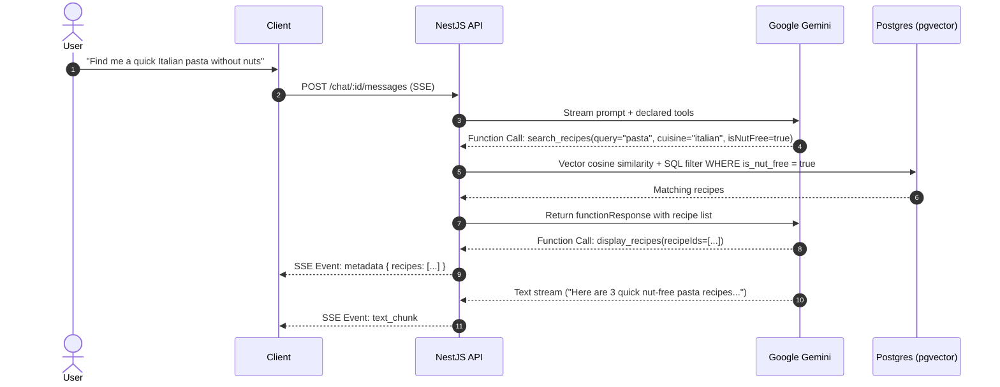

# SMAK — Backend API

This directory contains the core backend API for the SMAK culinary platform. It is built with NestJS and provides the application's business logic, real-time AI assistant streaming, vector similarity search, and asynchronous background processing.

## Service Overview

The backend is responsible for the following core capabilities:

- **AI Assistant**: Orchestrates multi-turn dialogues with Google Gemini, executing dynamic tool calls and streaming responses via Server-Sent Events.
- **Hybrid Recipe Search**: Combines relational filtering (diets, allergens, cook time, categories) with vector similarity search powered by `pgvector` and Gemini embeddings.
- **Asynchronous Moderation**: Validates submitted recipes and reviews against platform safety rules using BullMQ background queues and AI evaluation.
- **Billing & Quota Management**: Handles LiqPay payment processing, subscription lifecycles, and tier-based limits on AI requests and recipe collections.
- **Identity & Access Control**: Implements JWT authentication with refresh token rotation, Argon2 password hashing, and role-based guards.

### Related Documentation
- [Project Overview & Docker Setup](../README.md)
- [Frontend Client Documentation](../client/README.md)

---

## Table of Contents
- [Architecture & Tech Stack](#architecture--tech-stack)
- [Module Structure](#module-structure)
- [Engineering Highlights](#engineering-highlights)
- [AI Assistant & Search Pipeline](#ai-assistant--search-pipeline)
- [API Documentation (Swagger)](#api-documentation-swagger)
- [Environment Configuration](#environment-configuration)
- [Database & Migrations](#database--migrations)
- [Getting Started](#getting-started)
- [Available Scripts](#available-scripts)
- [License](#license)

---

## Architecture & Tech Stack

```
                              ┌────────────────────────┐
                              │  Client (HTTP / SSE)   │
                              └───────────┬────────────┘
                                          │
                                          │
                      ┌────────────────────────────────────────┐
                      │         NestJS HTTP Pipeline           │
                      │ (Middlewares, Guards, Interceptors...) │
                      └───────────────────┬────────────────────┘
                                          │
    ┌─────────────────────────────────────┴─────────────────────────────────────┐
    │                           NestJS Domain Modules                           │
    │ ┌────────────────────────┐ ┌────────────────────────┐ ┌─────────────────┐ │
    │ │       AuthModule       │ │       UserModule       │ │  BillingModule  │ │
    │ │ • Authentication       │ │ • Profiles & Accounts  │ │ • Subscriptions │ │
    │ │ • Session Security     │ │ • Dietary Constraints  │ │ • Payments      │ │
    │ └────────────────────────┘ └────────────────────────┘ └─────────────────┘ │
    │ ┌────────────────────────┐ ┌────────────────────────┐ ┌─────────────────┐ │
    │ │      RecipeModule      │ │       ChatModule       │ │ AssistantModule │ │
    │ │ • Recipe Management    │ │ • Chat Sessions        │ │ • AI Assistant  │ │
    │ │ • Hybrid Recipe Search │ │ • Message Handling     │ │ • Tool Execution│ │
    │ └────────────────────────┘ └────────────────────────┘ └─────────────────┘ │
    │ ┌────────────────────────┐ ┌────────────────────────┐ ┌─────────────────┐ │
    │ │    ModerationModule    │ │      ReviewModule      │ │ CollectionModule │ │
    │ │ • AI Content Safety    │ │ • Reviews & Ratings    │ │ • Saved Recipes │ │
    │ │                        │ │ • Threaded Comments    │ │                 │ │
    │ └────────────────────────┘ └────────────────────────┘ └─────────────────┘ │
    └─────────────────────────────────────┬─────────────────────────────────────┘
                                          │                           
          ┌─────────────────┬─────────────┴───────────┬──────────────────┐
          │                 │                         │                  │
┌───────────────────┐ ┌───────────────┐ ┌──────────────────────────────────────────────┐
│ PostgreSQL + pgvec│ │ Redis 7       │ │                External APIs                 │
│ • Relational Data │ │ • Job Queues  │ │ ┌────────────────────┐ ┌───────────────────┐ │
│ • Vector Data     │ │ • Rate Limits │ │ │Google Gemini GenAI │ │ Other Services    │ │
│                   │ │ • Cache       │ │ │ • LLM Models       │ │ • Cloudinary      │ │
└───────────────────┘ └───────────────┘ │ │ • Text Embeddings  │ │ • LiqPay          │ │
                                        │ │                    │ │ • SMTP Email      │ │
                                        │ └────────────────────┘ └───────────────────┘ │
                                        └──────────────────────────────────────────────┘

```

- **Framework**: [NestJS 10](https://nestjs.com/) (TypeScript, Express engine)
- **Database & ORM**: PostgreSQL 16 with `pgvector` extension via [TypeORM](https://typeorm.io/)
- **Caching & Queues**: Redis 7, [BullMQ](https://docs.bullmq.io/) with [@bull-board](https://github.com/felixmosh/bull-board) monitoring
- **AI & LLM**: Google GenAI SDK (`gemini-3.1-flash-lite`, `gemini-embedding-001`)
- **Authentication**: Passport.js with HttpOnly Cookies (JWT access/refresh token rotation, Argon2 hashing)
- **Media & Storage**: [Cloudinary](https://cloudinary.com/) SDK
- **Payment Processing**: [LiqPay](https://www.liqpay.ua/) with HMAC-SHA1 signature verification
- **Email Delivery**: Nodemailer / Mailtrap (SMTP)
- **API Docs**: Swagger / OpenAPI 3.0

---

## Module Structure

The API follows a domain-driven modular structure inside `src/`:

```
src/
├── assistant/               # Agentic Gemini AI orchestration & tool execution engine
│   └── tools/               # Function declarations and execution handlers
├── auth/                    # JWT token management, passport strategies & auth guards
├── billing/                 # Subscription tiers, invoices, LiqPay payment webhooks
├── chat/                    # Chat session management, message persistence & SSE streaming
├── embedder/                # Gemini vector embedding generator
├── infrastructure/          # Cross-cutting infrastructure modules
│   ├── cloudinary/          # Image upload and asset management
│   ├── database/            # PostgreSQL datasource, migrations & connection pooling
│   ├── email/               # Transactional email templates and delivery
│   ├── google-ai/           # Google GenAI client service
│   ├── liqpay/              # Payment signing and verification
│   ├── queue/               # BullMQ worker initialization & queue registry
│   ├── rate-limiting/       # Tier-based AI request throttler
│   ├── redis/               # Centralized Redis connection provider
│   └── swagger/             # OpenAPI documentation bootstrap
├── moderation/              # Automated AI content moderation queues for recipes & reviews
├── recipe/                  # Recipe CRUD, multi-criteria filtering, vector similarity search
├── recipe-collection/       # User cookbook collections with subscription-level quotas
├── recipe-review/           # Star reviews and rating aggregation listeners
├── recipe-review-comment/   # Threaded commentary under reviews
├── shared/                  # Common DTOs, prompt builders, decorators & pagination utils
└── user/                    # User profiles, dietary constraints, role/permission guards
```

---

## Engineering Highlights

### 1. Hybrid Vector & Relational Search
Instead of introducing a detached vector database (e.g., Pinecone/Milvus), the platform leverages PostgreSQL's native `pgvector` extension. This allows **atomic relational queries** (filtering by vegan status, allergens, difficulty, cook time, minimum health score) combined with **cosine similarity semantic ranking** in a single database transaction.

### 2. Multi-Turn Tool Calling with Streaming
The AI Assistant (`assistant.service.ts`) executes an iterative tool loop:
- Evaluates user intent and executes declared tools (`search_recipes`, `get_recipe_details`, `display_recipes`, `display_user_diets`, `display_user_allergies`).
- Formats structured tool outputs and returns them to Gemini across multiple turns (up to 20 iterations).
- Streams text chunks back to the client in real-time via Server-Sent Events (SSE) while injecting UI card metadata payloads.

### 3. Automated Asynchronous Content Moderation
When a user publishes a recipe or submits a review, a BullMQ job is dispatched to the moderation queue. Gemini evaluates the content against safety guidelines (profanity, safety, relevance) using structured JSON output. Based on the confidence score, the content is automatically approved or flagged for manual administrator review.

### 4. Tiered Rate Limiting & Quota Management
Custom guards (`restrictions-limit.guard.ts`, `ai-request-limit.guard.ts`) inspect the user's active subscription tier (Free, Pro, Premium) and enforce limits on daily AI messages, saved collections, and recipe creation directly in Redis.

---

## AI Assistant & Search Pipeline



---

## API Documentation (Swagger)

When running in development or staging mode, interactive OpenAPI documentation is automatically available:

- **Swagger UI URL**: `http://localhost:4000/admin/api-docs`
- **Specification Format**: OpenAPI 3.0 with request/response schema models for all DTOs.
- **Authentication in Swagger**: The API uses **HttpOnly Cookies** (`accessToken`, `refreshToken`) for authentication rather than manual Authorization headers. Executing the `/auth/login` endpoint directly within Swagger automatically sets session cookies for subsequent authorized requests in your browser.

---

## Environment Configuration

Environment variables are configured via local `.env` files. Detailed descriptions and default values for each parameter are documented directly in the template files:

- [`.env.example`](.env.example) — Template for local development.
- [`.env.prod.example`](.env.prod.example) — Template for containerized production deployment.

---

## Database & Migrations

Database schema management is handled via **TypeORM CLI** configured in [`typeorm.config.ts`](typeorm.config.ts).

### Migration Commands

```bash
# Apply pending migrations (development via ts-node)
npm run migration:run

# Generate a new migration from entity changes
npm run migration:generate -- src/infrastructure/database/migrations/YourMigrationName

# Revert the most recent migration
npm run migration:revert

# Run migrations in production (compiled dist/ for Docker containers)
npm run migration:run:prod
```

---

### Dataset & Seeding Pipeline

The repository includes an interactive importer script ([`scripts/import-dataset.ts`](scripts/import-dataset.ts)) to populate the database with a catalog of culinary recipes and pre-computed vector embeddings.

#### 1. Obtain the Dataset
To keep the Git repository lightweight, the full recipe dataset and media assets (~110 MB) are hosted on [GitHub Releases](https://github.com/alukiank/smak-culinary-platform/releases):

- **Download**: Get `smak-dataset.zip` from the latest [Release](https://github.com/alukiank/smak-culinary-platform/releases).
- **Extract**: Unpack the archive into the project root directory:
  - `dataset/recipes.json` — Structured JSON array with recipes (ingredients, step-by-step instructions, prep/cook durations, dietary flags, and taste profiles).
  - `dataset/images/` — Recipe cover photos for initial CDN upload.

> **Note**: You can inspect or extend `recipes.json` with custom recipes prior to importing.

#### 2. Automated Import Pipeline
When executed, the script automatically performs:
- **Path Detection**: Locates `dataset/recipes.json` automatically or prompts for custom paths.
- **Admin Assignment**: Associates imported recipes with an existing Admin account or creates a new one.
- **Cloudinary CDN Upload**: Uploads local cover photos to Cloudinary and attaches the generated URLs.
- **Vector Embedding Generation**: Calls the Google Gemini Embedding API (`gemini-embedding-001`) to generate 768-dimensional vector representations for `pgvector` semantic search.
- **Database Persistence**: Inserts normalized recipe records with published statuses, zeroed initial reviews, and indexed category relations.

#### 3. Run the Importer
```bash
npm run import:dataset
```

---

## Getting Started

### Prerequisites
- Node.js `20.x` or `22.x`
- Docker & Docker Compose (for running PostgreSQL with pgvector and Redis)

### 1. Start Infrastructure (PostgreSQL & Redis)
From the repository root:
```bash
docker compose up db redis -d
```

### 2. Install Dependencies
```bash
npm install
```

### 3. Apply Migrations
```bash
npm run migration:run
```

### 4. Start Development Server
```bash
npm run start:dev
```
The API server will listen on `http://localhost:4000`.

---

## Available Scripts

| Command | Description |
|---|---|
| `npm run start:dev` | Starts the server in watch/hot-reload mode |
| `npm run start:debug` | Starts with debugger on port 9229 |
| `npm run build` | Compiles TypeScript into `dist/` |
| `npm run start:prod` | Runs the compiled production server |
| `npm run lint` | Runs ESLint and auto-fixes formatting |
| `npm run test` | Executes unit test suites (Jest) |
| `npm run test:e2e` | Runs End-to-End integration tests |
| `npm run migration:run` | Executes database migrations |
| `npm run import:dataset` | Seeds recipe dataset into PostgreSQL |

---

## License

This backend application is licensed under the [PolyForm Noncommercial License 1.0.0](../LICENSE).  
Author: **Andrii Lukianenko** (<a.lukiank@gmail.com>)

